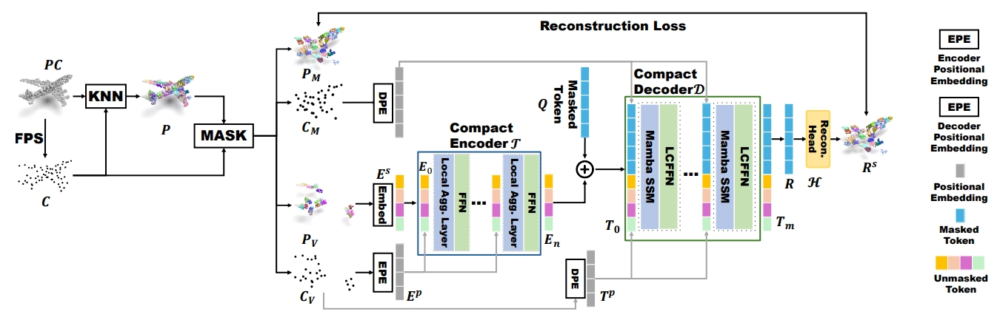

# LCM: Locally Constrained Compact Point Cloud Model for Masked Point Modeling

This repository provides the official implementation of [**LCM: Locally Constrained Compact Point Cloud
Model for Masked Point Modeling**](https://arxiv.org/abs/2405.17149) at NeurIPS 2024.


## 1. Introduction

The pre-trained point cloud model based on Masked Point Modeling (MPM) has exhibited substantial improvements across various tasks. However, these models heavily rely on the Transformer, leading to quadratic complexity and limited decoder, hindering their practice application. To address this limitation, we first conduct a comprehensive analysis of existing Transformer-based MPM, emphasizing the idea that redundancy reduction is crucial for point cloud analysis. To this end, we propose a Locally constrained Compact point cloud Model (LCM) consisting of a locally constrained compact encoder and a locally constrained Mamba-based decoder. Our encoder replaces self-attention with our local aggregation layers to achieve an elegant balance between performance and efficiency. Considering the varying information density between masked and unmasked patches in the decoder inputs of MPM, we introduce a locally constrained Mamba-based decoder. This decoder ensures linear complexity while maximizing the perception of point cloud geometry information from unmasked patches with higher information density. Extensive experimental results show that our compact model significantly surpasses existing Transformer-based models in both performance and efficiency, especially our LCM-based Point-MAE model, compared to the Transformer-based model, achieved an improvement of 1.84%, 0.67%, and 0.60% in average accuracy on the three variants of ScanObjectNN while reducing parameters by 88% and computation by 73%.



In the following, we will guide you how to use this repository step by step. 🤗

## 2. Preparation
```bash
git clone https://github.com/zyh16143998882/LCM.git
cd LCM/
```
### 2.1 Requirements

```bash
conda create -y -n lcm python=3.9
conda activate lcm
ppip install torch==1.13.1+cu117 torchvision==0.14.1+cu117 torchaudio==0.13.1 --extra-index-url https://download.pytorch.org/whl/cu117
pip install -r requirements.txt

# Chamfer Distance & emd
cd ./extensions/chamfer_dist
python setup.py install --user

# PointNet++
pip install "git+https://github.com/erikwijmans/Pointnet2_PyTorch.git#egg=pointnet2_ops&subdirectory=pointnet2_ops_lib"

# GPU kNN
pip install --upgrade https://github.com/unlimblue/KNN_CUDA/releases/download/0.2/KNN_CUDA-0.2-py3-none-any.whl

# Mamba
pip install causal-conv1d==1.1.1 mamba-ssm==1.1.1
```

### 2.2 Download the point cloud datasets and organize them properly
Before running the code, we need to make sure that everything needed is ready. 
First, the working directory is expected to be organized as below:

<details><summary>click to expand 👈</summary>

```
LCM/
├── cfgs/
├── data/
│   ├── ModelNet/ # ModelNet40
│   │   └── modelnet40_normal_resampled/
│   │       ├── modelnet40_shape_names.txt
│   │       ├── modelnet40_train.txt
│   │       ├── modelnet40_test.txt
│   │       ├── modelnet40_train_8192pts_fps.dat
│   │       └── modelnet40_test_8192pts_fps.dat
│   ├── ModelNetFewshot/ # ModelNet Few-shot
│   │   ├── 5way10shot/
│   │   │   ├── 0.pkl
│   │   │   ├── ...
│   │   │   └── 9.pkl
│   │   ├── 5way20shot/
│   │   │   ├── ...
│   │   │   ...
│   │   ├── 10way10shot/
│   │   │   ├── ...
│   │   │   ...
│   │   └── 10way20shot/
│   │       ├── ...
│   │       ...
│   ├── ScanObjectNN/ # ScanObjectNN
│   │   ├── main_split/
│   │   │   ├── training_objectdataset_augmentedrot_scale75.h5
│   │   │   ├── test_objectdataset_augmentedrot_scale75.h5
│   │   │   ├── training_objectdataset.h5
│   │   │   └── test_objectdataset.h5
│   │   └── main_split_nobg/
│   │       ├── training_objectdataset.h5
│   │       └── test_objectdataset.h5
│   ├── ShapeNet55-34/ # ShapeNet55/34
│   │   ├── shapenet_pc/
│   │   │   ├── 02691156-1a04e3eab45ca15dd86060f189eb133.npy
│   │   │   ├── 02691156-1a6ad7a24bb89733f412783097373bdc.npy
│   │   │   ├── ...
│   │   │   ...
│   │   └── ShapeNet-55/
│   │       ├── train.txt
│   │       └── test.txt
│   └── shapenetcore_partanno_segmentation_benchmark_v0_normal/ # ShapeNetPart
│       ├── 02691156/
│       │   ├── 1a04e3eab45ca15dd86060f189eb133.txt
│       │   ├── ...
│       │   ...
│       │── ...
│       │── train_test_split/
│       └── synsetoffset2category.txt
├── datasets/
├── ...
...
```
</details>

Here we have also collected the download links of required datasets for you:
- ShapeNet55/34 (for pre-training): [[link](https://github.com/lulutang0608/Point-BERT/blob/49e2c7407d351ce8fe65764bbddd5d9c0e0a4c52/DATASET.md)].
- ScanObjectNN: [[link](https://hkust-vgd.github.io/scanobjectnn/)].
- ModelNet40: [[link 1](https://github.com/lulutang0608/Point-BERT/blob/49e2c7407d351ce8fe65764bbddd5d9c0e0a4c52/DATASET.md)] (pre-processed) or [[link 2](https://modelnet.cs.princeton.edu/)] (raw).
- ModelNet Few-shot: [[link](https://github.com/lulutang0608/Point-BERT/blob/49e2c7407d351ce8fe65764bbddd5d9c0e0a4c52/DATASET.md)].
- ShapeNetPart: [[link](https://shapenet.cs.stanford.edu/media/shapenetcore_partanno_segmentation_benchmark_v0_normal.zip)].


## 3. Pre-train a point cloud model (e.g. Point-MAE (w/ LCM))
To pre-train Point-MAE (w/ LCM) on ShapeNet, you can run the following command: 

```python
# CUDA_VISIBLE_DEVICES=<GPU> python main.py --config cfgs/pretrain.yaml --exp_name <output_file_name>
CUDA_VISIBLE_DEVICES=0 python main.py --config cfgs/pretrain.yaml --exp_name pretrain_lcm
```
If you want to try other models or change pre-training configuration, e.g., mask ratios, just create a new configuration file and pass its path to `--config`.

For a quick start, we also have provided the pre-trained checkpoint of Point_LCM_MAE [[link](https://drive.google.com/drive/folders/1q0A-yXC1fmKKg38fbaqIxM79lvXpj4AO?usp=drive_link)].

## 4. Tune pre-trained point cloud models on downstream tasks


### 4.1 Object Classification

<details><summary>ModelNet40 (click to expand 👈)</summary>

```python
# CUDA_VISIBLE_DEVICES=<GPU> python main.py --config cfgs/finetune_modelnet.yaml --finetune_model --exp_name <output_file_name> --ckpts <path/to/pre-trained/model>
CUDA_VISIBLE_DEVICES=0 python main.py --config cfgs/finetune_modelnet.yaml --ckpts ./ckpts/pretrained/lcm_mae.pth --finetune_model --exp_name modelnet_lcm

# further enable voting mechanism
CUDA_VISIBLE_DEVICES=0 python main.py --config cfgs/finetune_modelnet.yaml --test --vote --exp_name modelnet_lcm_vote --ckpts ./experiments/finetune_modelnet/cfgs/modelnet_lcm/ckpt-best.pth
```
</details>

<details><summary>ScanObjectNN (OBJ-BG) (click to expand 👈)</summary>

```python
# CUDA_VISIBLE_DEVICES=<GPU> python main.py --config cfgs/finetune_scan_objbg.yaml --finetune_model --exp_name <output_file_name> --ckpts <path/to/pre-trained/model>
CUDA_VISIBLE_DEVICES=0 python main.py --config cfgs/finetune_scan_objbg.yaml --ckpts ./ckpts/pretrained/lcm_mae.pth --finetune_model --exp_name bg_lcm
```
</details>

<details><summary>ScanObjectNN (OBJ-ONLY) (click to expand 👈)</summary>

```python
# CUDA_VISIBLE_DEVICES=<GPU> python main.py --config cfgs/finetune_scan_objonly.yaml --finetune_model --exp_name <output_file_name> --ckpts <path/to/pre-trained/model>
CUDA_VISIBLE_DEVICES=0 python main.py --config cfgs/finetune_scan_objonly.yaml --ckpts ./ckpts/pretrained/lcm_mae.pth --finetune_model --exp_name only_lcm
```
</details>

<details><summary>ScanObjectNN (PB-T50-RS) (click to expand 👈)</summary>

```python
# CUDA_VISIBLE_DEVICES=<GPU> python main.py --config cfgs/finetune_scan_hardest.yaml --finetune_model --exp_name <output_file_name> --ckpts <path/to/pre-trained/model>
CUDA_VISIBLE_DEVICES=0 python main.py --config cfgs/finetune_scan_hardest.yaml --ckpts ./ckpts/pretrained/lcm_mae.pth --finetune_model --exp_name hard_lcm
```
</details>


### 4.2 Part Segmentation on ShapeNet-Part

<details><summary>Part Segmentation (click to expand 👈)</summary>

```python
cd segmentation

# CUDA_VISIBLE_DEVICES=<GPU> python main.py --model Point_LCM_SEG --ckpts <path/to/pre-trained/model> --log_dir path/to/data --batch_size 16
CUDA_VISIBLE_DEVICES=0 python main.py --model Point_LCM_SEG --ckpts ../ckpts/pretrained/lcm_mae.pth --log_dir seg --batch_size 16 
```
</details>

### 4.3 Object Detection

```python
cd detection

CUDA_VISIBLE_DEVICES=0,1,2,3 python main.py --dataset_name scannet --checkpoint_dir lcm_mae --model_name 3detr_lcm --loss_giou_weight 1 --loss_no_object_weight 0.25 --nqueries 256 --ngpus 4 --batchsize_per_gpu 8 --enc_dim 384 --pretrain_ckpt ../ckpts/pretrained/lcm_mae.pth
```
</details>


## 5. Validate with checkpoints
For reproducibility, logs and checkpoints of fine-tuned models of Point-MAE (w/ LCM) can be found in the table below.

***Notes***: For classification downstream tasks, we select eight seeds (0-7) to obtain the ***average performance reported in our paper***. Here we attach the checkpoint with the ***highest performance*** among the eight seeds.


| Task              | Dataset           | Parameters            | log                                                                                                                   | Acc.       | Checkpoints Download                                                                                     |
|-------------------|-------------------|-----------------------|-----------------------------------------------------------------------------------------------------------------------|------------|----------------------------------------------------------------------------------------------------------|
| Pre-training      | ShapeNet          | 8.15M                 | -                                                                                                                     | N.A.       | [Point-MAE (w/ LCM)](https://drive.google.com/file/d/1d3dV-5uPUzSfSWwDkYwRJtOFZG7M3z1s/view?usp=drive_link)          |
| Classification    | ScanObjectNN      | 2.70M                 | [finetune_scan_objbg.log](https://drive.google.com/file/d/1gxlORd8rvx05BlIvmBajoMm3Myyw7zIQ/view?usp=drive_link)        | 95.18%     | [OBJ-BG](https://drive.google.com/file/d/15OUuk6DU_pgdGPxpQRdAocVyW2Bm3S0S/view?usp=drive_link)          |
| Classification    | ScanObjectNN      | 2.70M                 | [finetune_scan_objonly.log](https://drive.google.com/file/d/1H_mvU0ss3Mtv5XBP8LGR6A2rpKph1-90/view?usp=drive_link)   | 93.12%     | [OBJ-ONLY](https://drive.google.com/file/d/1udQtbVb4cQnF1uhuctiKF4H79nHFdej1/view?usp=drive_link)          |
| Classification    | ScanObjectNN      | 2.70M                 | [finetune_scan_hardest.log](https://drive.google.com/file/d/1llzRd0lmUY-LtcKYnG1xoZwM1XY1sElt/view?usp=drive_link)   | 89.35%     | [PB-T50-RS](https://drive.google.com/file/d/16e-XAV2lN0QV8mNp0zOMdtIAeohAi4DA/view?usp=drive_link)        |


The evaluation commands with checkpoints should be in the following format:
```python
CUDA_VISIBLE_DEVICES=<GPU> python main.py --test --config <yaml_file_name> --exp_name <output_file_name> --ckpts <path/to/ckpt>
```

<details><summary>For example, click to expand 👈</summary>

```python
# object classification on ScanObjectNN (PB-T50-RS)
CUDA_VISIBLE_DEVICES=0 python main.py --config cfgs/finetune_scan_hardest.yaml --ckpts ./ckpts/hardest/ckpt-best.pth --test --exp_name hard_test

# object classification on ScanObjectNN (OBJ-BG)
CUDA_VISIBLE_DEVICES=0 python main.py --config cfgs/finetune_scan_objbg.yaml --ckpts ./ckpts/bg/ckpt-best.pth --test --exp_name bg_test

# object classification on ScanObjectNN (OBJ-ONLY)
CUDA_VISIBLE_DEVICES=0 python main.py --config cfgs/finetune_scan_objonly.yaml --ckpts ./ckpts/only/ckpt-best.pth --test --exp_name only_test
```
</details>


## 6. Bibliography

If you find this code useful or use the toolkit in your work, please consider citing:

```
@article{zha2024lcm,
  title={LCM: Locally Constrained Compact Point Cloud Model for Masked Point Modeling},
  author={Zha, Yaohua and Li, Naiqi and Wang, Yanzi and Dai, Tao and Guo, Hang and Chen, Bin and Wang, Zhi and Ouyang, Zhihao and Xia, Shu-Tao},
  journal={arXiv preprint arXiv:2405.17149},
  year={2024}
}
```

## 7. Acknowledgements

Our codes are built upon [Point-BERT](https://github.com/Julie-tang00/Point-BERT), [Point-MAE](https://github.com/Pang-Yatian/Point-MAE), [MaskPoint](https://github.com/WisconsinAIVision/MaskPoint), [ACT](https://github.com/RunpeiDong/ACT), [Point-M2AE](https://github.com/ZrrSkywalker/Point-M2AE)). Thanks for their efforts.

## 8. Contact
If you have any question, you can raise an issue or email Yaohua Zha (zyh1614399882@gmail.com).